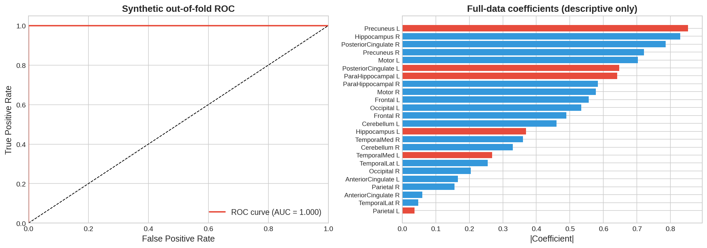

# Verified synthetic example

The revised core notebook executed end to end on 15 September 2026, without atlas downloads.

| Property | Observed value |
|---|---|
| Data | 80 synthetic subjects, seed 42 |
| Regional features | 24 |
| Out-of-fold AUC | 1.000 |
| Five fold AUCs | 1.000, 1.000, 1.000, 1.000, 1.000 |
| Scaling | Fitted within each training fold |

These values reflect deliberately imposed differences in simulated groups; they are not clinical performance estimates. Optional atlas rendering was not exercised.

The command in the root README regenerates CSVs, JSON and plots under `outputs/`. Historical notebook outputs were cleared so the source notebook does not mix old and corrected evaluations.
